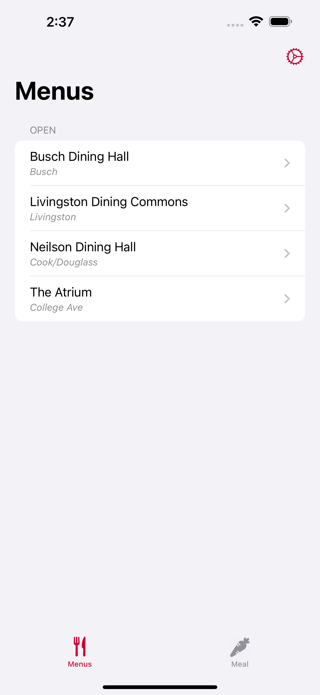
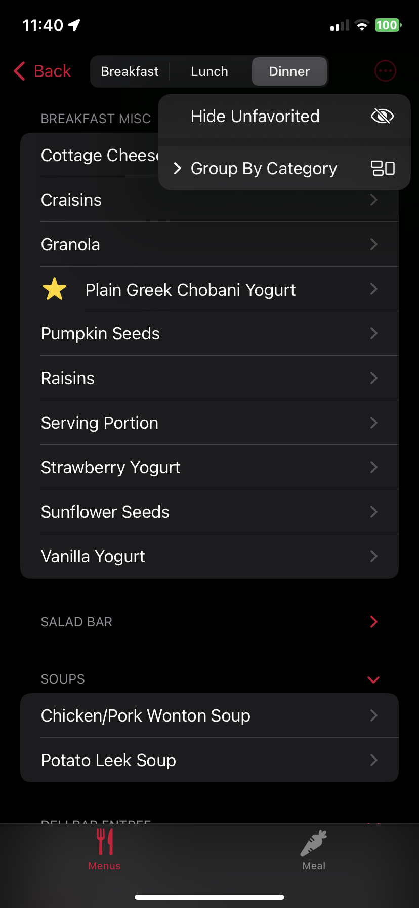
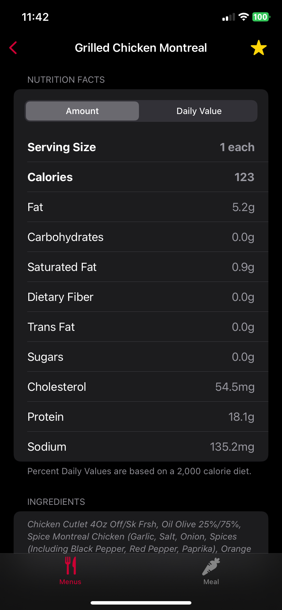
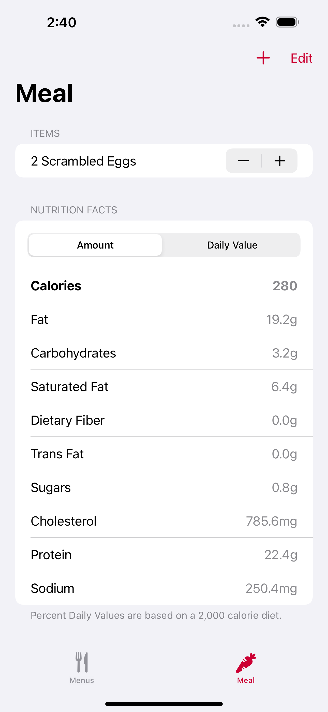
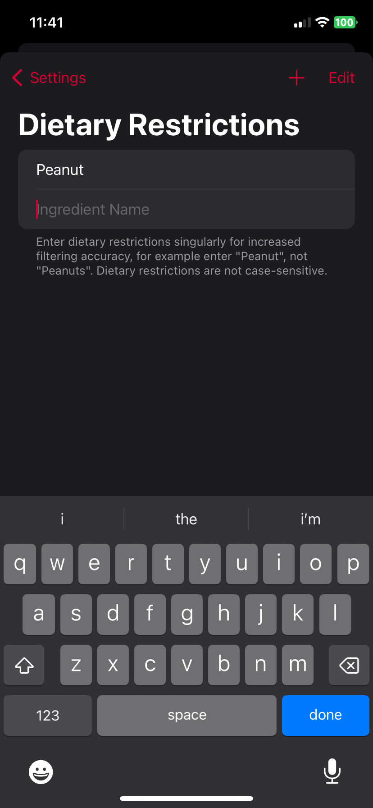

#  MenRU
An unofficial Rutgers University dining hall menu app for iOS written in Swift using SwiftUI, SwiftData and [SwiftSoup](https://github.com/scinfu/SwiftSoup). Name pronounced *men-rooh* or *men-are-you*.

## Features
- View menus scraped directly from [food.rutgers.edu](https://food.rutgers.edu)
- Favorite items, which adds a star next to the item every time it appears on current and future menus
- View nutrition facts (amount and daily value) and ingredients for items
- Filter ingredients and warn users about foods containing their dietary restrictions
- Calculate nutrition facts of an entire meal
- Display weekend breakfast options under breakfast and lunch

## Screenshots

  
  
  
  
  
  

