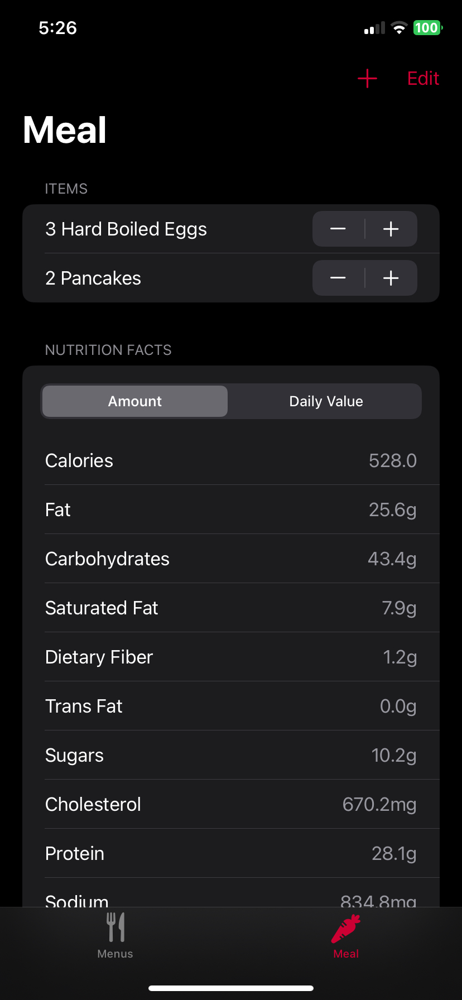

#  MenRU
Rutgers dining hall menu app for iOS in Swift using SwiftUI and [SwiftSoup](https://github.com/scinfu/SwiftSoup).

## Features
- Gets website data with http request (.aspx)
- Parses data using SwiftSoup
- Favoriting items
- Filter ingredients for dietary restrictions
- Calculate nutrition facts of an entire meal

## Screenshots

  
  
  
  
  

